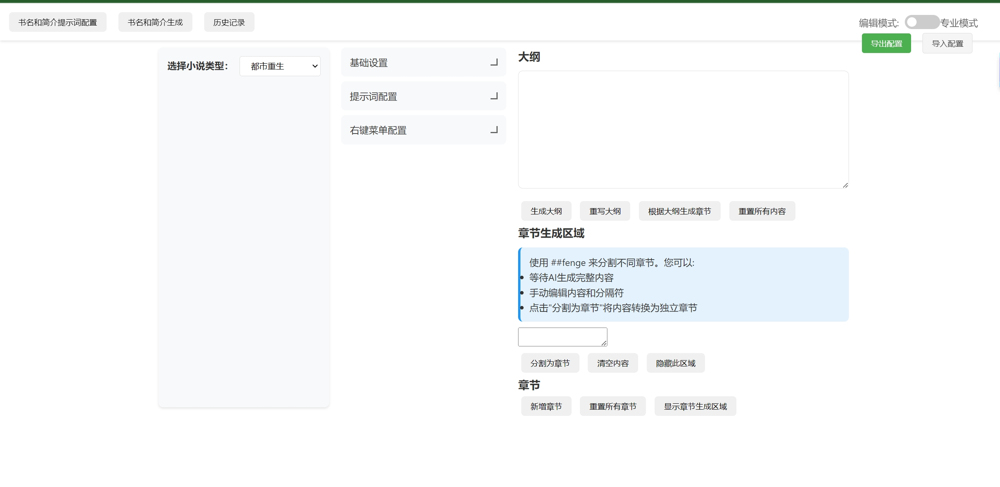
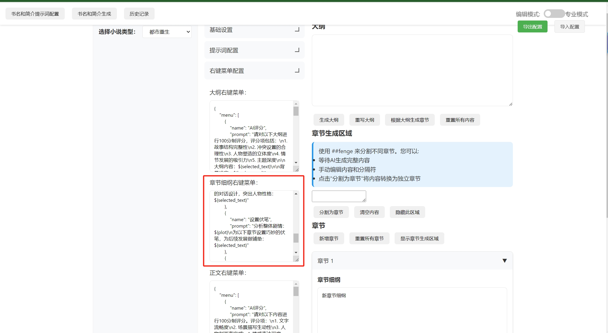
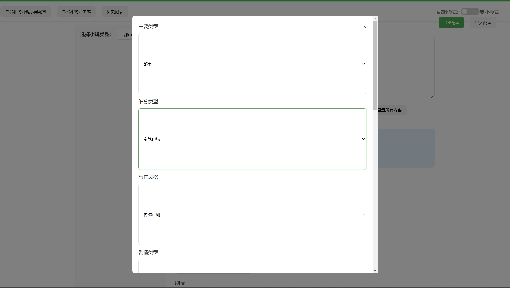
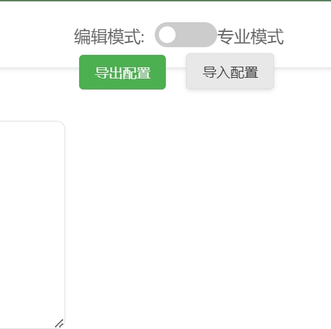
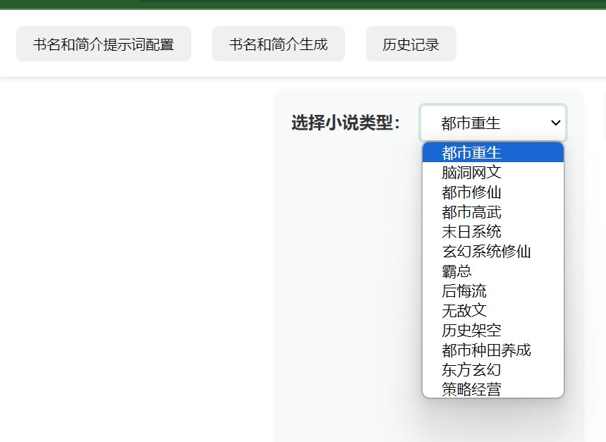

# AI 小说创作助手 (AI Novel Writing Assistant)

一个基于 AI 的智能小说创作辅助工具，通过 AI 技术提升创作效率，效率提升20倍，让写作更轻松、更专业。

## 重要提示

当前版本v1.0

如果要使用多选小说类型默认的角色提示词配置，需要在 `templates/index.html` 中添加以下脚本引用：
```html
<script src="{{ url_for('static', filename='config.js') }}"></script>
```
## 体验地址

http://ssss.baby:20000/

## 核心特点

1. **本地数据存储**
   - 所有数据完全保存在用户本地浏览器中
   - 确保数据安全和隐私

2. **高度灵活的接口支持**
   - 支持多种 AI 接口接入
   - 所有提示词均可在 Web 界面中自由配置
   - 支持自定义模型参数

3. **智能写作流程**
   - 完整支持"大纲→细纲→正文"创作流程
   - 上下文记忆功能，保持写作连贯性
   - 支持书名和简介的智能生成
   - 快捷键功能 shift+L 可以自定义选中自己收藏的文字
4. **强大的自定义功能**
   - 支持自定义模块右键菜单
   - 支持文本润色、去 AI 痕迹、智能评分
   - 通过 JSON 配置灵活组装提示词变量

5. **便捷的配置管理**
   - 支持配置文件导入导出
   - 便于备份和迁移
   - 适合签约作者使用

6. **多场景优化**
   - 支持简易模式操作
   - 内置 AI 评分功能
   - 支持多种写作场景

## 项目结构

```
├── app.py              # Flask 应用主程序
├── static/            # 静态资源文件夹
│   ├── bookinfo.js    # 书籍信息相关功能
│   ├── config.js      # 不同类型小说的提示词
│   ├── cs.css         # 样式文件
│   ├── mode-shortcut.js # 简易模式相关功能
│   └── outin.js       # 导入导出功能
├── templates/         # 前端模板文件夹
│   └── index.html     # 主页面模板
└── jpg/              # 功能截图文件夹
```

## 功能展示

### 1. 主界面概览


### 2. 智能右键菜单


支持的优化选项：
- 润色优化
- AI 痕迹去除
- 智能评分
- 自定义优化选项

### 3. 简易模式


- 简化操作流程
- 内置 AI 评分功能
- 快速创作模式
- 快捷键功能

### 4. 智能生成功能


- 智能书名生成
- 简介自动生成
- 多样风格选择

### 5. 配置导入导出


- 支持配置文件管理
- 便捷的备份还原
- 配置共享功能

### 6. 预置提示词


- 丰富的预置提示词
- 支持自定义修改
- 场景化提示词组合

## 快速开始

### 安装
```bash
# 克隆项目
git clone https://github.com/wfcz10086/AI-automatically-generates-novels.git

# 进入项目目录
cd AI-automatically-generates-novels

# 安装依赖
pip install -r requirements.txt
```

### 配置
1. 修改 `app.py` 中的 AI 模型接口地址：
```python
OLLAMA_API_URL = "http://your-api-url"
```

2. 启动应用：
```bash
python app.py
```

默认访问地址：http://localhost:20000

## 使用流程

1. **基础配置**
   - 选择或导入配置文件
   - 设置 AI 接口参数
   - 配置提示词模板

2. **创作流程**
   - 生成书名和简介
   - 创建作品大纲
   - 展开章节细纲
   - 撰写正文内容
   - 应用智能优化

3. **内容优化**
   - 使用右键菜单优化内容
   - 应用 AI 评分功能
   - 去除 AI 痕迹
   - 润色文本

## 提示词系统

### 变量系统
支持的变量包括：
- `${background}` - 背景设定
- `${characters}` - 人物设定
- `${relationships}` - 角色关系
- `${plot}` - 剧情架构
- `${style}` - 写作风格
- `${selected_text}` - 选中文本
- `${outline}` - 当前大纲
- `${chapter_outline}` - 当前章节大纲

## AI 模型支持

支持多种 AI 模型接入：
- Ollama（默认）
- OpenAI API
- Claude API
- 文心一言
- 讯飞星火
- ChatGLM
- 通义千问
- 360智脑


详细配置方法请参考代码中的示例配置,然后让chatgpt给你生成一个。

## 许可证

MIT License

## 问题反馈

如有问题或建议，请通过以下方式反馈：
1. 提交 GitHub Issue


