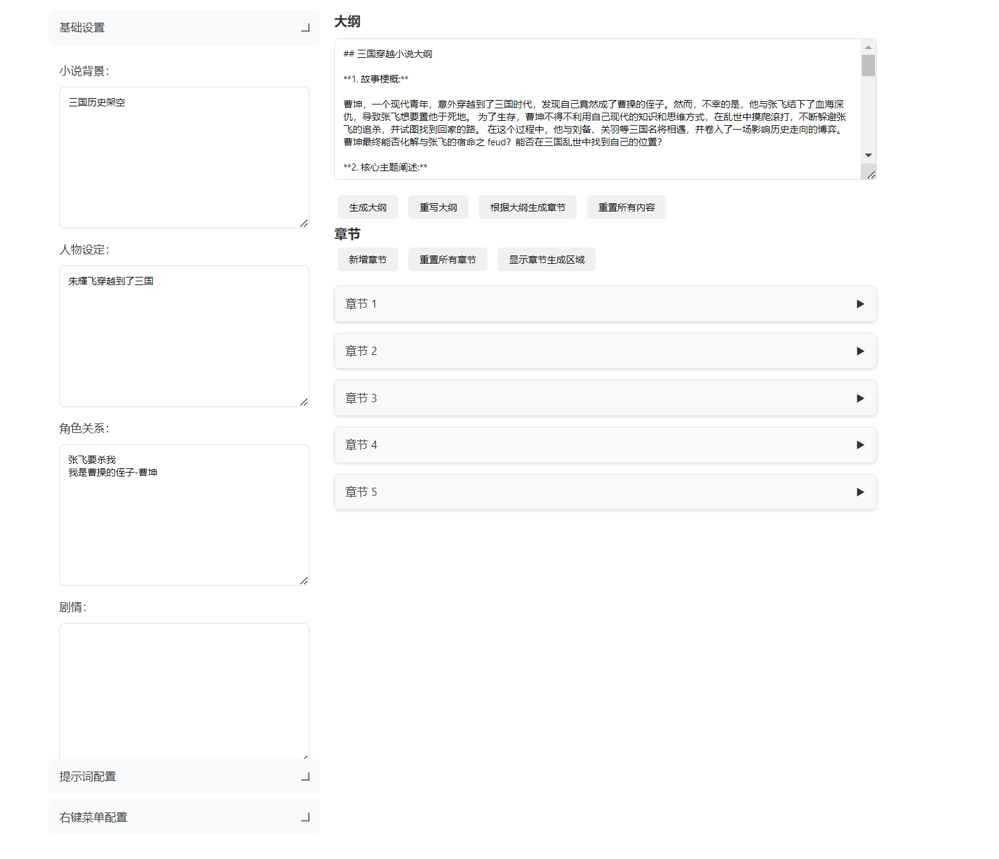

# AI 小说创作助手 (AI Novel Writing Assistant)

一个基于 AI 的智能小说创作辅助工具，通过 AI 技术提升创作效率，效率提升20倍，让写作更轻松、更专业。现已升级到 v2.0。

## 功能速览


*完整功能界面，支持多种智能写作辅助功能*


*AI智能书名生成功能展示*


*AI智能简介生成功能展示*

## 联系方式


## 核心特色：专业提示词系统

### 1. 多层级提示词体系
- **大纲提示词**：专业策划角度的故事结构设计
  ```
  作为一名专业的网络小说策划，基于背景、人物、关系等信息设计...
  1. 提炼核心冲突，设计多重矛盾
  2. 设计3-5个重大转折点
  3. 人物塑造要立体，性格鲜明
  ...
  ```

- **章节提示词**：精确的章节结构规划
  ```
  每章节包含：
  - 核心看点
  - 情节线索
  - 感情线发展
  - 伏笔设置
  ...
  ```

- **内容提示词**：专业写作技巧指导
  ```
  多感官描写要求：
  - 视觉：场景细节、人物表情
  - 听觉：环境声音、语气语调
  - 触觉：物理感受、温度变化
  ...
  ```

### 2. 智能右键菜单系统
每个创作环节都配备专门的右键优化菜单：

- **大纲优化菜单**
  - AI评分
  - 深化冲突
  - 增加伏笔
  - 完善人物动机
  - 强化感情线
  - 优化节奏
  - 扩充细节
  - 提升高潮

- **章节优化菜单**
  - 章节评分
  - 深化情节
  - 强化冲突
  - 优化结构
  - 增加细节
  - 完善对话
  - 设置伏笔
  - 强化感情

- **正文优化菜单**
  - 文字评分
  - 优化文笔
  - 扩写对话
  - 强化情感
  - 添加细节
  - 改写视角
  - 去除说教
  - 润色升华

### 3. 变量系统
灵活的变量替换系统，支持：
- `${background}` - 背景设定
- `${characters}` - 人物设定
- `${relationships}` - 角色关系
- `${plot}` - 剧情架构
- `${style}` - 写作风格
- `${outline}` - 当前大纲
- `${chapter_outline}` - 章节大纲

## 其他核心功能

1. **智能创作功能**
   - AI智能起名
   - 自动生成简介
   - 同窗口AI助手
   - 自动字数统计

2. **主题切换功能**
   - 支持明暗主题
   - 护眼模式
   - 自定义主题色

3. **数据管理**
   - 本地数据存储
   - 配置导入导出
   - 自动保存功能

## 使用教程

### 1. 基础配置
1. 配置基础信息：
   - 填写小说背景
   - 设置人物设定
   - 定义角色关系
   - 规划核心剧情
   - 选择写作风格

2. 配置提示词：
   - 根据需要修改大纲提示词
   - 调整章节提示词
   - 自定义内容提示词

3. 配置右键菜单：
   - 设置大纲优化选项
   - 配置章节优化选项
   - 定制正文优化选项

### 2. 创作流程
1. 使用AI助手生成书名和简介
2. 利用提示词生成大纲
3. 展开章节细纲
4. 生成章节内容
5. 使用右键菜单优化文本

## 安装说明

```bash
git clone https://github.com/wfcz10086/AI-automatically-generates-novels.git
cd AI-automatically-generates-novels
pip install -r requirements.txt
python app.py
```

访问：http://localhost:20000

## 配置文件说明

项目结构：
```
project/
├── app.py              # Flask主程序
├── static/
│   ├── bookinfo.js    # 书籍信息功能
│   ├── config.js      # 提示词配置
│   ├── cs.css         # 样式文件
│   ├── chat-and-counter.js    # 聊天和字数统计
│   ├── theme-switcher.js      # 主题切换
│   └── mode-shortcut.js       # 快捷操作
└── templates/
    └── index.html     # 主页面
```


## 重要特性：多模型支持系统

### 支持的AI模型

本系统支持多种主流AI模型，您可以根据需求选择不同的模型：

1. **ChatGPT (app-chatgpt.py)**
   - OpenAI的GPT模型支持
   - 支持GPT-3.5和GPT-4
   - 可配置API密钥和模型参数
   ```python
   # app-chatgpt.py 配置示例
   OPENAI_API_KEY = "your-api-key"
   MODEL = "gpt-3.5-turbo"  # 或 "gpt-4"
   ```

2. **Claude (app-claude.py)**
   - Anthropic的Claude模型支持
   - 支持Claude 2和Claude 3
   - 精确的推理和写作能力
   ```python
   # app-claude.py 配置示例
   CLAUDE_API_KEY = "your-api-key"
   MODEL = "claude-3-opus-20240229"  # 或其他版本
   ```

3. **文心一言 (app-wenxinyiyang.py)**
   - 百度文心大模型支持
   - 中文创作优化
   - 适合国内用户使用
   ```python
   # app-wenxinyiyang.py 配置示例
   WENXIN_API_KEY = "your-api-key"
   WENXIN_SECRET_KEY = "your-secret-key"
   ```

4. **通义千问 (app-tongyiqianwen.py)**
   - 阿里通义千问模型支持
   - 强大的中文理解能力
   - 适合长文本创作
   ```python
   # app-tongyiqianwen.py 配置示例
   TONGYI_API_KEY = "your-api-key"
   ```

5. **豆包 (app-doubao.py)**
   - 字节跳动豆包大模型
   - 创新的中文写作能力
   - 适合网文创作
   ```python
   # app-doubao.py 配置示例
   DOUBAO_API_KEY = "your-api-key"
   ```

### 模型切换使用说明

```

1. **配置模型参数**
- 复制对应的模型配置文件（例如 `app-chatgpt.py`）到 `app.py`
- 或重命名为 `app.py` 替换原文件
- 配置相应的 API 密钥和参数

2. **启动服务**
```bash
python app.py
```

### 模型特点对比

| 模型 | 优势 | 适用场景 | 价格 |
|------|------|----------|------|
| ChatGPT | 通用性强，创意丰富 | 各类小说创作 | 较贵 |
| Claude | 推理能力强，文风优美 | 文学性较强的创作 | 较贵 |
| 文心一言 | 中文优化好，理解深 | 传统文学创作 | 按量计费 |
| 通义千问 | 中文创作自然 | 网文创作 | 按量计费 |
| 豆包 | 网文风格强 | 网络小说创作 | 按量计费 |

### 使用建议

1. **模型选择**
- 对文学性要求高的作品推荐使用 Claude
- 中文网文创作推荐使用豆包或通义千问
- 追求性价比可以使用 ChatGPT 3.5
- 需要稳定性的可以使用文心一言

2. **参数优化**
- 每个模型都有独特的参数设置
- 建议根据创作需求调整温度等参数
- 可以通过配置文件微调模型行为

3. **成本控制**
- 建议先使用较低成本的模型测试
- 重要章节再使用更高级的模型
- 可以混合使用不同模型降低成本


## 版本历史

### v2.0 (2024.12)
- 新增主题切换
- 添加字数统计
- 集成AI助手
- 增强提示词系统
- 优化用户界面

### v1.0 (2024.11)
- 首次发布

## 许可证

MIT License

## 问题反馈
- 项目主页：[GitHub](https://github.com/wfcz10086/AI-automatically-generates-novels)
- 问题反馈：[Issues](https://github.com/wfcz10086/AI-automatically-generates-novels/issues)
