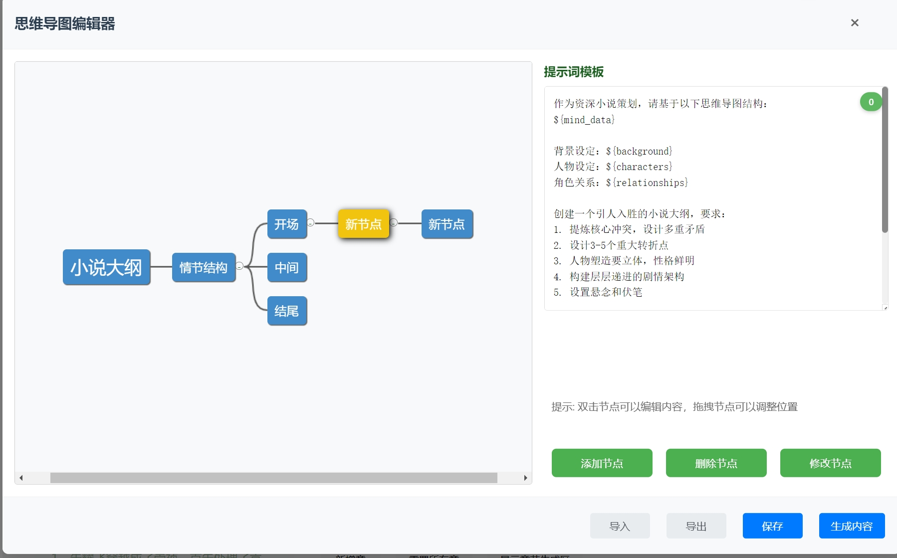
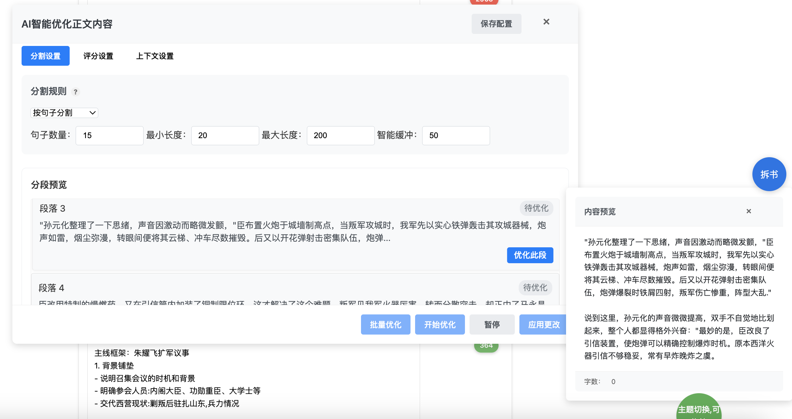
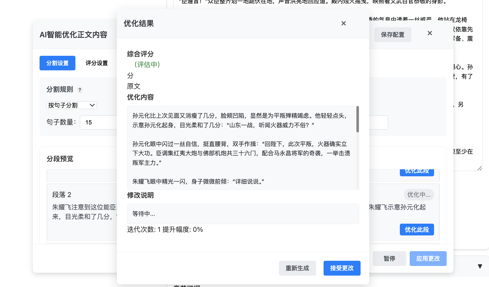
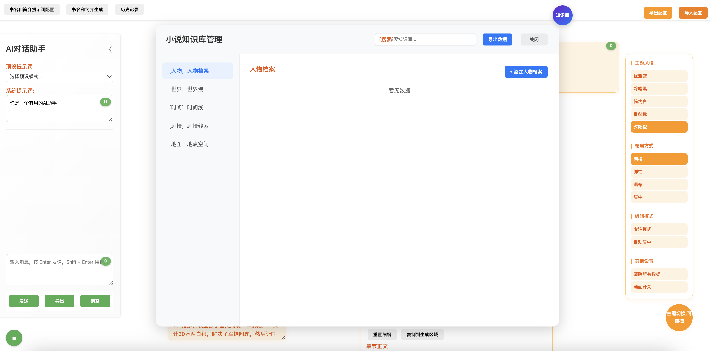
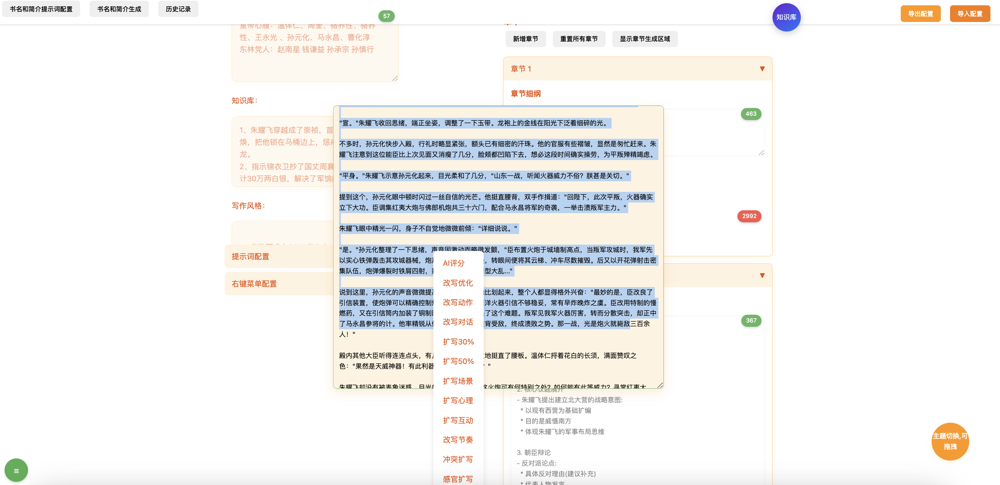
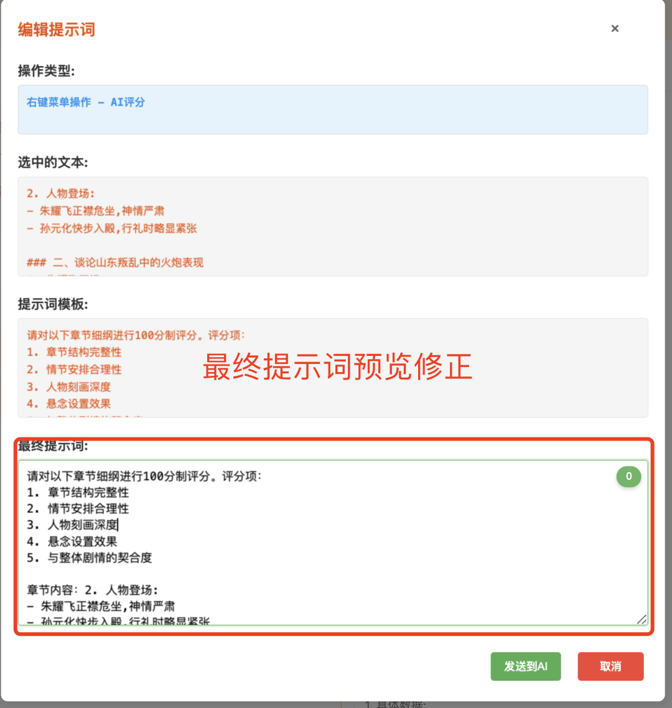
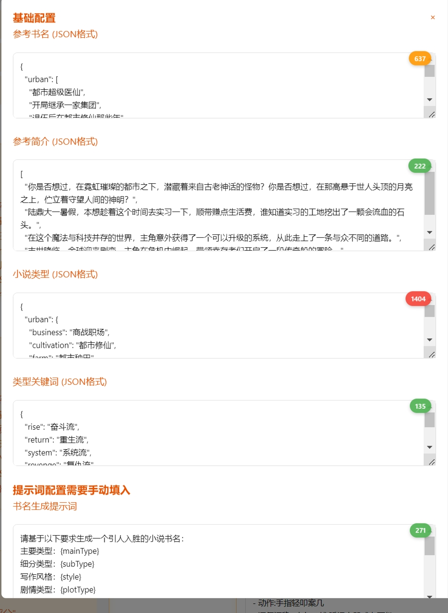
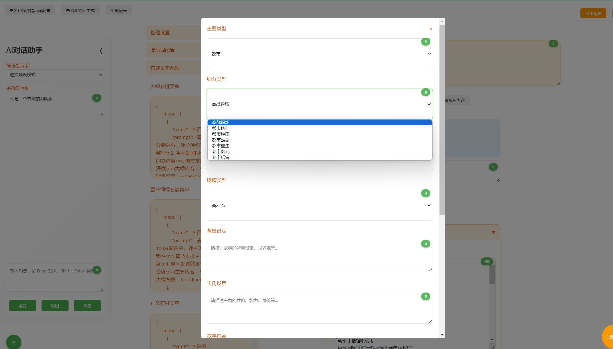

# AI 小说创作助手 (AI Novel Writing Assistant)

一个基于ai +提示词 的智能小说创作生产力工具，已经有数十位作者通过该工具实现了自己的小说梦。通过 AI 技术提升创作效率以及完善的提示词管理功能，实现智能拆书、智能生书名简介、正文润色等效率提升20倍，让写作更轻松、更专业。现已升级到 v5.0。
```
【重要必读】
**支持思维导图构建总纲、章节
**支持AI自我优化小说【探索性质】
**支持写作知识库管理**
**支持shift+L快捷词条输入**
**支持任何主流大模型接入**
**支持自定义肤色、提示词导入导出**
**支持超大字数长文本记忆**
**支持选中大纲、章节、正文右键润色、扩写、去AI味**
**支持多套小说提示词库管理**
**支持拆书功能**


/gen接口这个可以是效果比较好的模型接口，用于大纲、章节、正文的生成
/gen2这个可以自己替换低成本模型的接口，用于AI批量自我迭代【探索】和拆书

知识库管理相关数据存储于基础配置-->知识库中 。如果您不经常用用知识库，那么可以在此文本填充相关剧情，同样也会被引用组装到提示词中
思维导图构建总纲、章节非常实用

```

在线体验 http://ssss.baby:20000

**app.py 接入相关的模型，请使用chatgpt来生成相关的和模型想匹配的代码**

## 可以直接利用带后缀的的 app-xxx.py
##  如果接入不了，请使用app.py 生成提示词 
```
 $app.py源码
 api地址 http://XXXX
 ai模型为XXXX 
 根据这个，请帮我生成【阿里千问|文心一言|豆包】相关的api，同样需要支持流，要注意可能的参数 私钥参数等不一样。原来的返回格式最好和我给你的兼容，这个需要特别注意
```
## 功能速览
思维导图.png


*可拖拽的思维导图*



*智能按照句子、段落、字符数智能切割 和预览*


*设定好分数和迭代次数*


*完整功能界面，支持多种智能写作辅助功能*


*智能右键润色功能*



*智能AI右键润色功能*


*AI智能书名生成功能展示*


*AI智能简介生成功能展示*


## 核心特色：专业提示词系统

### 1. 多层级提示词体系
- **大纲提示词**：专业策划角度的故事结构设计
  ```
  作为一名专业的网络小说策划，基于背景、人物、关系等信息设计...
  1. 提炼核心冲突，设计多重矛盾
  2. 设计3-5个重大转折点
  3. 人物塑造要立体，性格鲜明
  ...
  ```

- **章节提示词**：精确的章节结构规划
  ```
  每章节包含：
  - 核心看点
  - 情节线索
  - 感情线发展
  - 伏笔设置
  ...
  ```

- **内容提示词**：专业写作技巧指导
  ```
  多感官描写要求：
  - 视觉：场景细节、人物表情
  - 听觉：环境声音、语气语调
  - 触觉：物理感受、温度变化
  ...
  ```

### 2. 智能右键菜单系统
每个创作环节都配备专门的右键优化菜单：

- **大纲优化菜单**
  - AI评分
  - 深化冲突
  - 增加伏笔
  - 完善人物动机
  - 强化感情线
  - 优化节奏
  - 扩充细节
  - 提升高潮

- **章节优化菜单**
  - 章节评分
  - 深化情节
  - 强化冲突
  - 优化结构
  - 增加细节
  - 完善对话
  - 设置伏笔
  - 强化感情

- **正文优化菜单**
  - 文字评分
  - 优化文笔
  - 扩写对话
  - 强化情感
  - 添加细节
  - 改写视角
  - 去除说教
  - 润色升华

### 3. 变量系统
灵活的变量替换系统，支持：
- `${background}` - 背景设定
- `${characters}` - 人物设定
- `${relationships}` - 角色关系
- `${plot}` - 剧情架构
- `${style}` - 写作风格
- `${outline}` - 当前大纲
- `${chapter_outline}` - 章节大纲

## 其他核心功能

1. **智能创作功能**
   - AI智能起名
   - 完善相关知识库，支持长章节记忆
   - 自动生成简介
   - 同窗口AI助手
   - 自动字数统计
   - 快键键词条功能shift+L，随时插入关键卡片

2. **主题切换功能**
   - 支持明暗主题
   - 护眼模式
   - 自定义主题色
   - 支持专业模式、简易模式

3. **数据管理**
   - 本地数据存储
   - 配置导入导出
   - 自动保存功能
   - 方便随时写作

## 使用教程

### 1. 基础配置
1. 配置基础信息：
   - 填写小说背景
   - 设置人物设定
   - 定义角色关系
   - 规划核心剧情
   - 选择写作风格

2. 配置提示词：
   - 根据需要修改大纲提示词
   - 调整章节提示词
   - 自定义内容提示词

3. 配置右键菜单：
   - 设置大纲优化选项
   - 配置章节优化选项
   - 定制正文优化选项
   - 在大纲、章节、文本框中选中文本进行润色、改写等

### 2. 创作流程
1. 使用AI助手生成书名和简介
2. 利用提示词生成大纲
3. 展开章节细纲
4. 生成章节内容
5. 使用右键菜单优化文本

## 安装说明

```bash
git clone https://github.com/wfcz10086/AI-automatically-generates-novels.git
cd AI-automatically-generates-novels
pip install -r requirements.txt
python app.py
```

访问：http://localhost:20000


## 重要特性：多模型支持系统

### 支持的AI模型

本系统支持多种主流AI模型，您可以根据需求选择不同的模型：

### 模型切换使用说明

```

1. **配置模型参数**
- 复制对应的模型配置文件（例如 `app-chatgpt.py`）到 `app.py`
- 或重命名为 `app.py` 替换原文件
- 配置相应的 API 密钥和参数

2. **启动服务**
```bash
python app.py
```


## 版本历史
### v5.0(2024.12.12)
- 新增可拖拽的思维导图生成大纲、章节功能
- 修复显示 文本域重叠问题
- 支持提示词和思维导图结合
- 修复其他诸多bug


### v4.0(2024.12.9)
- 新增ai根据自我评分实现迭代功能
- 智能分割、预览、评分
- 修正一些体验性、操作舒服点 


### v3.0 (2024.12.8)
- 增加提交前的所有提示词预览修改
- 优化显示
- 增加词条卡，shift+l 触发。
- 增加知识库 和json方式存储
- 修复其他bug


### v2.0 (2024.12.5)
- 新增主题切换
- 添加字数统计
- 集成AI助手
- 增强提示词系统
- 优化用户界面

### v1.0 (2024.11)
- 首次发布

## 许可证

MIT License

## 问题反馈


- 项目主页：[GitHub](https://github.com/wfcz10086/AI-automatically-generates-novels)
- 问题反馈：[Issues](https://github.com/wfcz10086/AI-automatically-generates-novels/issues)
